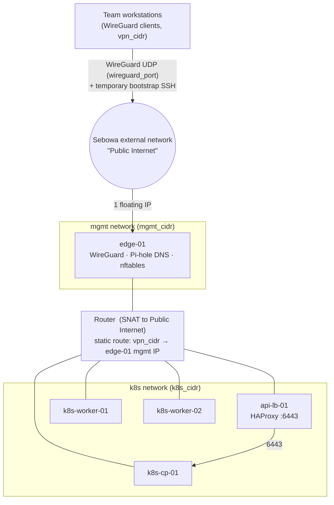

# Network and trust-boundary design (Week 1)

Owner: Olerato (`Ole06`) · Reviewer: Phathutshedzo (`saxs-14`) · Issue #9

**Status: agreed design (merged in #18).** The instructor answered #16 and approved the team's private CIDRs in #21. Per the instructor's rule on #23, real addresses (CIDRs, fixed IPs, floating IP, SSH sources) are **never** written on GitHub: they live only in the private `terraform.tfvars` and the team's private Discord channel. Terraform state stays local on the private workstation of whoever applies, and the Rocky 9 bootstrap user is `rocky`. edge-01 uses flavor `large` (team decision, #22). The WireGuard port and the WireGuard/bootstrap SSH source ranges are still team decisions. Every value not yet agreed is a Terraform variable with **no default**; nothing below invents a value. Real values live only in the private `terraform.tfvars`.

Sources: `week1/README.md` §4–5 and §22, issue #8 (Sebowa discovery), and the reference design in `nyameko/infra-hpc-qc-k8s` @ `c493703` (`docs/tutorials/02-networking-and-security.md`, `terraform/modules/{network,security}`), reduced to the five-node POC.

## 1. Topology



| Object | Name (prefix = `name_prefix`) | Value |
| --- | --- | --- |
| External network | data source | `Public Internet` (issue #8) |
| Management network/subnet | `<prefix>-mgmt` | `mgmt_cidr`, gateway, pool: team choice, proposed in #21 |
| Kubernetes network/subnet | `<prefix>-k8s` | `k8s_cidr`, gateway, pool: team choice, proposed in #21 |
| Router | `<prefix>-router` | gateway on `Public Internet`, interfaces on both subnets |
| Static route | on the router | `vpn_cidr` → `edge-01` fixed mgmt IP (VPN return path) |
| Floating IP | 1, on `edge-01` only | quota is exactly 1 (issue #8) |
| WireGuard client subnet | not a Neutron network | `vpn_cidr`: team choice, proposed in #21 |

### Host placement

| Host | Network | Fixed IP | Security group | Public? |
| --- | --- | --- | --- | --- |
| `edge-01` | mgmt | `node_fixed_ips.edge_01` | `<prefix>-edge` | yes, the only floating IP |
| `api-lb-01` | k8s | `node_fixed_ips.api_lb_01` | `<prefix>-api-lb` | no |
| `k8s-cp-01` | k8s | `node_fixed_ips.k8s_cp_01` | `<prefix>-k8s-control-plane` | no |
| `k8s-worker-01` | k8s | `node_fixed_ips.k8s_worker_01` | `<prefix>-k8s-worker` | no |
| `k8s-worker-02` | k8s | `node_fixed_ips.k8s_worker_02` | `<prefix>-k8s-worker` | no |

Fixed IPs are required, not cosmetic: the router's static route needs the edge address as `next_hop`, and HAProxy needs a stable `k8s-cp-01` backend.

## 2. Trust zones

| Zone | Who is in it | Trusted for |
| --- | --- | --- |
| Internet | everyone | nothing, except WireGuard to edge and the temporary bootstrap SSH |
| VPN (`vpn_cidr`) | team workstations with an approved WireGuard peer | admin SSH (then `kubectl` on `k8s-cp-01`), DNS |
| mgmt (`mgmt_cidr`) | `edge-01` | SSH jump to private hosts during bootstrap, DNS service |
| k8s (`k8s_cidr`) | api-lb, control plane, workers | node-to-node Kubernetes traffic only |

Rules of thumb:

- Only `edge-01` is reachable from the Internet. Nothing in the k8s network ever gets a floating IP.
- The Kubernetes API is reached through `api-lb-01`, never directly from the VPN to `k8s-cp-01` (reference repo removed that rule deliberately).
- Security groups (OpenStack, before the VM) and nftables (inside edge) are separate layers. This doc owns the security groups; the nftables rules on edge are Rendani's Ansible work and should mirror the edge column below.

## 3. VPN return path (needs a decision)

A workstation packet arrives on `edge-01` over WireGuard and leaves edge towards the k8s network with source address in `vpn_cidr`. Two ways to make that work:

| Option | How | Effect |
| --- | --- | --- |
| **A. Routed (recommended)** | router static route `vpn_cidr → edge` **and** `allowed_address_pairs = [vpn_cidr]` on the edge port; edge forwards without NAT | private hosts see the real VPN client IP, so security-group rules can say "from `vpn_cidr`" and Wazuh/Suricata evidence shows which member did what |
| B. NAT on edge | edge masquerades VPN traffic to its own mgmt IP | no route or address pair needed, but every VPN action looks like it came from edge; `vpn_cidr` rules on private hosts would never match |

Option A keeps attribution, which the Week-5 forensics work depends on. Without the `allowed_address_pairs` entry Neutron's port security drops the forwarded packets as spoofed; the reference template has the static route but not the address pair, so this is a deliberate addition to verify at apply time. Rendani's edge playbook must enable IP forwarding and **not** masquerade traffic destined for the private networks. Decision owner: Olerato + Rendani, reviewed by the captain.

## 4. Security-group matrix

All rules are IPv4 ingress. OpenStack adds an allow-all egress rule to every new group; egress is left open in Week 1. Source values are variables.

### Week 1 (required for the Week-1 exit gate)

| # | Target group | Port / proto | Source | Purpose | Lifecycle |
| --- | --- | --- | --- | --- | --- |
| 1 | edge | 22/tcp | `bootstrap_ssh_cidrs` | bootstrap/recovery SSH | **temporary**: removed by Terraform only after WireGuard private access is proven for at least two members (#13) |
| 2 | edge | `wireguard_port`/udp | `wireguard_allowed_cidrs` | WireGuard | permanent |
| 3 | edge | 22/tcp | `vpn_cidr` | admin SSH over VPN | permanent |
| 4 | edge | 53/udp + 53/tcp | `mgmt_cidr`, `k8s_cidr`, `vpn_cidr` | Pi-hole DNS | permanent |
| 5 | api-lb, control-plane, worker | 22/tcp | `mgmt_cidr` | SSH `ProxyJump` via edge during bootstrap | permanent |
| 6 | api-lb, control-plane, worker | 22/tcp | `vpn_cidr` | direct private SSH over VPN (`week1/README.md` §22) | permanent |
| 7 | api-lb | 6443/tcp | `k8s_cidr` | nodes and `k8s-cp-01` admins → stable API endpoint | permanent |
| 8 | control-plane | 6443/tcp | `k8s_cidr` | HAProxy → kube-apiserver | permanent |

There is deliberately **no** 6443 rule from `vpn_cidr` to anything. The reference repo allows `vpn_cidr → api-lb:6443`, but this course forbids `kubectl` on workstations (`docs/COMMAND-LOCATIONS.md`): admins SSH to `k8s-cp-01` over the VPN and run `kubectl` there, which rule 7 covers.

**Rules 3 and 4 with source `vpn_cidr` never match at the Neutron layer.** A VPN client reaches edge-01 *inside* the WireGuard UDP tunnel (rule 2); once decrypted on `wg0`, that traffic is filtered by edge's nftables, not by the security group. The rules are kept because they are harmless, but if VPN-to-edge SSH or DNS fails, debug nftables on edge, not the security group. (VPN traffic that edge forwards to the *private* hosts does pass their security groups; that is what rule 6 is for.)

### Week 2 (Kubernetes + Cilium; add before kubeadm)

| # | Target group | Port / proto | Source | Purpose |
| --- | --- | --- | --- | --- |
| 9 | control-plane | 2379-2380/tcp | `k8s_cidr` | etcd |
| 10 | control-plane, worker | 10250/tcp | `k8s_cidr` | kubelet |
| 11 | control-plane, worker | 8472/udp | `k8s_cidr` | Cilium VXLAN |
| 12 | control-plane, worker | 4240/tcp | `k8s_cidr` | Cilium health |
| 13 | control-plane, worker | ICMP | `k8s_cidr` | node/Cilium health |
| 14 | control-plane, worker | 30000-32767/tcp+udp | `k8s_cidr` | NodePort |

### Week 3 (observability/security; listed so nobody adds them by hand)

| # | Target group | Port / proto | Source | Purpose |
| --- | --- | --- | --- | --- |
| 15 | edge | 1514-1515/tcp | `mgmt_cidr`, `k8s_cidr` | Wazuh agents → manager |
| 16 | edge | 55000/tcp | `k8s_cidr` | Wazuh API |
| 17 | control-plane, worker | 9100/tcp, 9962-9964/tcp | `k8s_cidr` | node-exporter, Cilium metrics |

Not carried over from the reference (outside the five-node POC): Slurm, NFS, Hermes VM, Cloudflare HTTP/HTTPS on edge, Octavia.

## 5. Variables (no invented defaults)

| Variable | Meaning | Value |
| --- | --- | --- |
| `mgmt_cidr`, `mgmt_gateway_ip`, `mgmt_pool_start`, `mgmt_pool_end` | management subnet | team choice; proposal in #21 |
| `k8s_cidr`, `k8s_gateway_ip`, `k8s_pool_start`, `k8s_pool_end` | Kubernetes subnet | team choice; proposal in #21 |
| `vpn_cidr` | WireGuard client subnet | team choice; proposal in #21 |
| `node_fixed_ips` | map of the five fixed IPs | chosen inside the CIDRs, outside the DHCP pools |
| `wireguard_port` | edge WireGuard UDP port | team decision pending (reference uses 51820) |
| `wireguard_allowed_cidrs` | who may reach WireGuard | team decision pending |
| `bootstrap_ssh_cidrs` | who may reach temporary SSH | team decision pending; Terraform rejects `0.0.0.0/0` |
| `dns_nameservers` | resolvers handed out by Neutron DHCP | see open item 3 |
| `external_network_name` | provider network | `Public Internet` (issue #8) |

Must not overlap each other **or** the Kubernetes pod/service CIDRs Rendani chooses in Week 2.

## 6. Open items

1. ~~CIDRs~~ **Settled** in #21 (values private). The Week-2 pod network must not overlap mgmt, k8s or VPN.
2. **WireGuard port and allowed sources; bootstrap SSH sources:** team decision, tracked on this PR.
3. **DNS during bootstrap:** Pi-hole on edge does not exist until Ansible runs, so pointing `dns_nameservers` at edge from day one breaks package installs. Proposal: start with `dns_nameservers = []` so Neutron's DHCP hands out its default resolver (verify after apply with `cat /etc/resolv.conf` on a host), then switch the subnets to the edge IP through Terraform once Pi-hole is validated.
4. **VPN return path:** confirm option A (routed + `allowed_address_pairs`) with Rendani's edge playbook.
5. **Internal DNS domain** for Pi-hole: team decision, tracked in #13.

## 7. How this will be verified (issue #11)

```bash
# RUN ON: WORKSTATION, after a reviewed apply
openstack network list; openstack subnet list
openstack router show <prefix>-router -c routes -c interfaces_info
openstack floating ip list              # exactly one, attached to edge-01's port
openstack port show <edge-01-port> -c allowed_address_pairs
openstack security group rule list <prefix>-edge
```

Then the path tests from `week1/README.md` §12 and §22: SSH to edge, ProxyJump to private hosts, and private SSH over WireGuard before rule 1 is removed.
