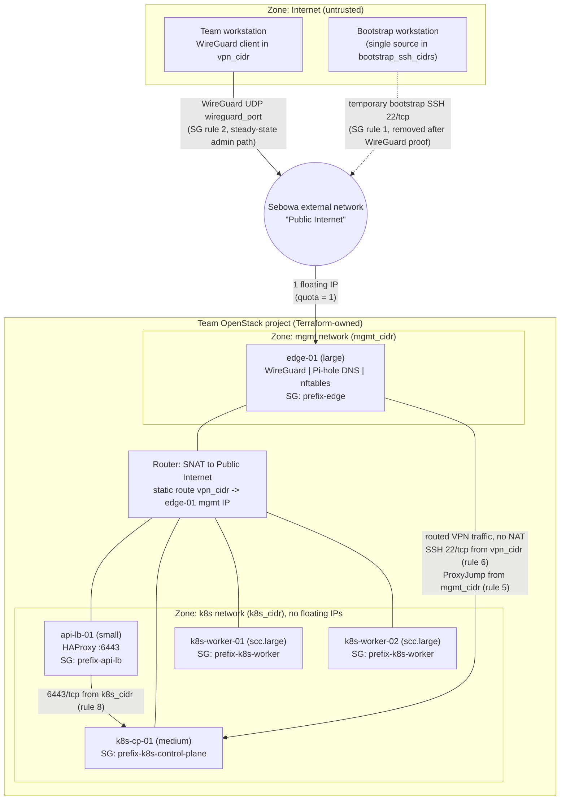

# Week-1 architecture / trust-boundary diagram

Editable source: [`trust-boundary.mmd`](trust-boundary.mmd) (Mermaid). The block below is a copy of it so GitHub renders it inline; edit the `.mmd` file first, then copy it here.

Design source: [`docs/network-design.md`](../../../docs/network-design.md) (#18, follow-up #26). SG rule numbers refer to the matrix in §4 of that doc.

**Address-free (instructor rule on #23):** only Terraform variable names (`mgmt_cidr`, `k8s_cidr`, `vpn_cidr`, `bootstrap_ssh_cidrs`, `wireguard_port`) appear. Real values live in the private `terraform.tfvars` and Discord #purple-1 only.



## What the diagram claims (and where it is proven)

| Claim | Evidence |
| --- | --- |
| Only `edge-01` has a floating IP; exactly 1 exists | #11 apply/verification (Ole06, 2026-10-05 13:25 UTC); captain re-check 13:41 UTC |
| Only WireGuard UDP is open to anywhere; bootstrap SSH is a single source | captain verification on #11, 2026-10-05 13:41 UTC |
| VPN return path: router static route + `allowed_address_pairs` on edge port | #11 verification: 1 static route, 1 address pair |
| 4 security groups, 17 ingress rules | #11 verification; matches the #18 Week-1 matrix |
| No 6443 from `vpn_cidr`; `kubectl` runs on `k8s-cp-01` only | `docs/network-design.md` §4, `docs/COMMAND-LOCATIONS.md` |
| WireGuard admin path works | **pending**: #13 (roles merged in #27/#35, not yet applied) |

## Re-rendering an image export

GitHub renders the Mermaid block above directly, so no image is committed yet. To export an SVG/PNG (e.g. for the Friday demo slides, #25):

```bash
# RUN ON: WORKSTATION (needs Node.js)
npx -y @mermaid-js/mermaid-cli -i trust-boundary.mmd -o trust-boundary.svg
```

Commit any export next to the `.mmd` source so it stays editable.
